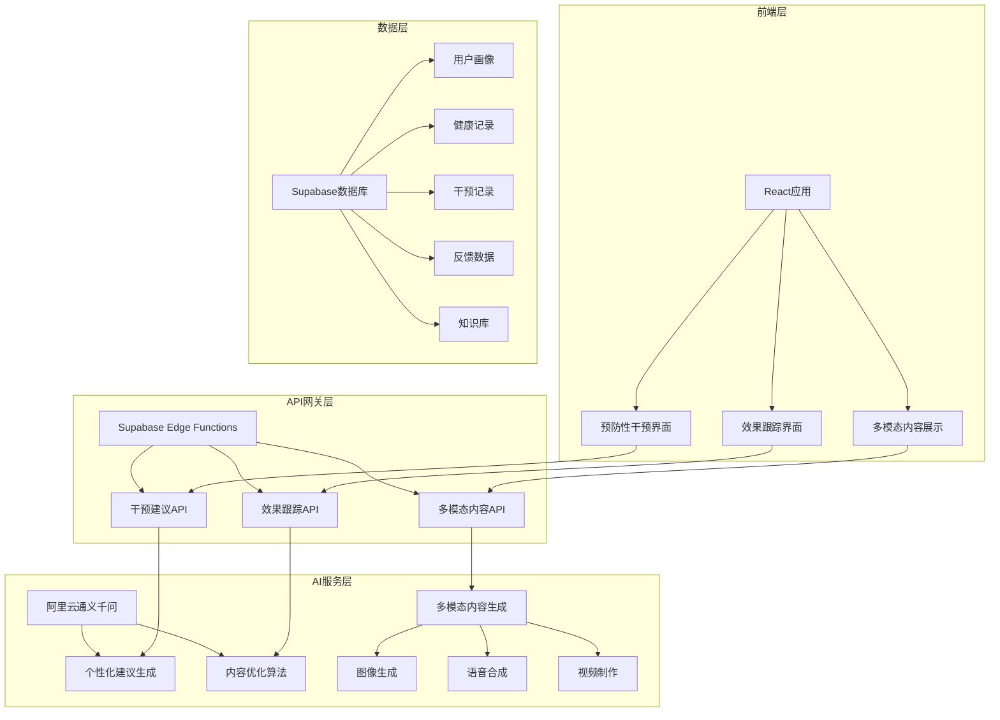

# 智能预防性干预系统开发方案

## 系统概述

智能预防性干预系统是一个基于AI技术的个性化健康管理系统，通过分析用户健康数据、行为模式和风险因素，生成定制化的预防性建议和干预方案，帮助老年群体及高风险人群主动管理健康，预防疾病发生。

## 核心功能模块

### 1. 智能建议生成引擎

#### 1.1 健康风险分析引擎
```typescript
interface HealthRiskAnalysis {
  riskLevel: 'low' | 'medium' | 'high' | 'critical';
  riskFactors: RiskFactor[];
  confidence: number;
  recommendations: PersonalizedRecommendation[];
}

interface RiskFactor {
  type: 'cardiovascular' | 'diabetes' | 'osteoporosis' | 'cognitive' | 'depression';
  severity: number;
  controllable: boolean;
  preventionPotential: number;
}
```

#### 1.2 预防措施生成器
- **用药提醒优化**：基于用药历史、药物相互作用、副作用风险生成个性化用药方案
- **生活方式改善建议**：结合用户偏好和可行性，生成可执行的健康习惯建议
- **定期检查提醒**：基于年龄、性别、家族史制定个性化体检计划

#### 1.3 智能建议算法
```python
def generate_preventive_recommendations(user_profile, risk_analysis, qianwen_api):
    prompt = f"""
    基于以下用户信息生成个性化预防建议：
    
    用户画像：{user_profile}
    风险评估：{risk_analysis}
    
    请生成以下类型的建议：
    1. 立即行动建议（1-7天内执行）
    2. 短期目标（1-4周）
    3. 长期计划（3-6个月）
    4. 紧急预警信号识别
    
    每个建议需包含：
    - 具体行动步骤
    - 预期效果
    - 执行难度评估
    - 建议优先级
    """
    
    return qianwen_api.generate_text(prompt)
```

### 2. 个性化干预方案生成器

#### 2.1 干预类型分类
- **健康管理类**：血压监测、血糖控制、体重管理
- **心理干预类**：情绪调节、认知训练、社交促进
- **生活方式类**：运动计划、营养调整、睡眠优化
- **医疗管理类**：用药优化、随访提醒、并发症预防

#### 2.2 个性化算法
```typescript
interface PersonalizedPlan {
  planId: string;
  userId: string;
  riskCategories: string[];
  preferences: UserPreferences;
  interventionHistory: InterventionRecord[];
  currentPlan: InterventionItem[];
  effectiveness: EffectivenessMetrics;
}

interface InterventionItem {
  id: string;
  type: 'exercise' | 'diet' | 'medication' | 'social' | 'cognitive';
  title: string;
  description: string;
  schedule: Schedule;
  difficulty: number;
  adherenceRate: number;
  expectedOutcome: OutcomeMetric[];
}
```

#### 2.3 偏好学习机制
- 收集用户偏好数据（运动类型、饮食喜好、时间安排）
- 分析历史干预效果和依从性
- 动态调整建议内容以提高接受度

### 3. 行为引导机制

#### 3.1 运动计划系统
```typescript
interface ExercisePlan {
  exercises: Exercise[];
  frequency: number;
  duration: number;
  intensity: 'low' | 'moderate' | 'high';
  adaptiveFeatures: {
    weatherAdaptation: boolean;
    equipmentAdjustment: boolean;
    fitnessLevelAdaptation: boolean;
  };
}

interface Exercise {
  name: string;
  category: 'aerobics' | 'strength' | 'flexibility' | 'balance';
  instructions: string[];
  videoGuide: string;
  modifications: string[];
  safetyTips: string[];
}
```

#### 3.2 睡眠改善方案
- **睡眠监测**：通过可穿戴设备分析睡眠质量
- **睡眠建议**：基于睡眠模式提供个性化改善方案
- **环境优化**：智能调节卧室环境（温度、光线、噪音）

#### 3.3 饮食建议系统
```typescript
interface DietRecommendation {
  mealPlans: MealPlan[];
  nutritionalGoals: NutritionalGoal[];
  culturalPreferences: string[];
  restrictions: DietaryRestriction[];
  shoppingSuggestions: IngredientSuggestion[];
}

interface MealPlan {
  meals: Meal[];
  dailyCalories: number;
  macroDistribution: MacroDistribution;
  sampleRecipes: Recipe[];
}
```

#### 3.4 社交活动推荐
- **兴趣匹配**：基于用户爱好推荐相关活动
- **地理位置服务**：推荐附近的社交活动和兴趣小组
- **虚拟社交**：为行动不便的用户提供线上社交机会

### 4. 干预效果跟踪系统

#### 4.1 效果监测指标
```typescript
interface EffectivenessMetrics {
  primaryOutcomes: {
    biomarkerChanges: BiomarkerRecord[];
    symptomImprovement: SymptomScore[];
    qualityOfLifeIndex: number;
  };
  
  secondaryOutcomes: {
    adherenceRate: number;
    userSatisfaction: number;
    behavioralChanges: BehaviorChange[];
    longTermSustainability: number;
  };
}
```

#### 4.2 智能调整机制
- **实时反馈分析**：根据用户反馈和行为数据动态调整方案
- **A/B测试**：自动测试不同干预策略的效果
- **预测性调整**：基于早期指标预测长期效果，提前调整方案

#### 4.3 报告生成系统
- **个人健康报告**：定期生成个性化健康进展报告
- **医生共享报告**：为医疗专业人员提供详细的干预数据
- **家庭成员报告**：根据权限设置分享相关健康信息

### 5. 健康知识库系统

#### 5.1 循证医学数据库
```typescript
interface EvidenceBasedGuideline {
  condition: string;
  evidenceLevel: 'A' | 'B' | 'C';
  recommendations: ClinicalRecommendation[];
  supportingStudies: StudyReference[];
  lastUpdated: Date;
  applicablePopulations: PopulationCriteria[];
}

interface ClinicalRecommendation {
  intervention: string;
  strength: 'strong' | 'moderate' | 'weak';
  expectedBenefit: string;
  potentialRisks: string[];
  implementationSteps: string[];
}
```

#### 5.2 老年护理最佳实践库
- **护理标准操作规程**：涵盖日常生活护理、医疗护理、心理护理
- **安全防范指南**：跌倒预防、药物管理、认知障碍照护
- **家庭护理技能**：照护者培训材料、技能评估工具

#### 5.3 预防医学指导
- **疾病预防指南**：基于年龄、性别、风险因素的预防策略
- **健康促进建议**：生活方式干预、筛查建议、免疫接种
- **公共卫生信息**：季节性疾病预防、疫情防护指导

### 6. 多模态建议展示系统

#### 6.1 内容生成策略
```typescript
interface MultiModalContent {
  text: TextContent;
  image: ImageContent;
  audio: AudioContent;
  video: VideoContent;
  interactive: InteractiveContent;
}

interface TextContent {
  mainMessage: string;
  detailedDescription: string;
  quickTips: string[];
  followUpActions: string[];
}
```

#### 6.2 智能内容生成
- **文字内容**：使用通义千问API生成易读易懂的中文健康指导
- **图像内容**：生成说明性图表、动作示范图、食物搭配图
- **语音内容**：转换为自然语音播报，支持方言适配
- **视频内容**：创建演示视频、教育短片、专家访谈片段

#### 6.3 自适应展示
- **设备适配**：根据用户设备类型优化内容展示格式
- **认知水平适配**：根据用户的认知能力调整内容复杂度
- **视觉能力适配**：考虑老年人的视觉特点，提供大字体、高对比度版本

## 技术实现方案

### 1. 阿里云通义千问API集成

#### 1.1 API配置
```typescript
interface QianwenConfig {
  apiKey: string;
  endpoint: string;
  model: 'qwen-turbo' | 'qwen-plus' | 'qwen-max';
  maxTokens: number;
  temperature: number;
}

class QianwenService {
  private config: QianwenConfig;
  
  async generatePersonalizedAdvice(
    userProfile: UserProfile,
    healthData: HealthData,
    interventionHistory: InterventionHistory[]
  ): Promise<PersonalizedAdvice> {
    const prompt = this.buildAdvicePrompt(userProfile, healthData, interventionHistory);
    
    const response = await this.callQianwenAPI({
      model: this.config.model,
      input: {
        prompt: prompt,
        parameters: {
          max_tokens: this.config.maxTokens,
          temperature: this.config.temperature
        }
      }
    });
    
    return this.parseAdviceResponse(response);
  }
}
```

#### 1.2 提示词工程
```typescript
const PROMPT_TEMPLATES = {
  HEALTH_ADVICE: `
    角色：你是一位资深的预防医学专家和老年健康顾问。
    
    任务：为用户生成个性化的健康预防建议和干预方案。
    
    用户信息：
    - 年龄：{age}
    - 性别：{gender}
    - 既往病史：{medicalHistory}
    - 当前健康状况：{currentHealth}
    - 生活方式：{lifestyle}
    - 偏好设置：{preferences}
    
    风险评估：
    {riskAssessment}
    
    历史干预效果：
    {interventionHistory}
    
    请生成包含以下内容的建议：
    1. 风险因素分析
    2. 优先级建议（立即、短期、长期）
    3. 具体行动步骤
    4. 预期效果和注意事项
    5. 监测指标和调整机制
    
    要求：
    - 建议具体可操作
    - 考虑老年人的身体特点
    - 避免过于复杂的医学术语
    - 提供多种选择方案
  `,
  
  EXERCISE_PLAN: `
    为用户制定个性化运动计划：
    
    用户运动偏好：{exercisePreferences}
    身体限制：{physicalLimitations}
    当前活动水平：{activityLevel}
    
    请生成包含：
    - 适合的运动类型
    - 运动强度和频率
    - 安全注意事项
    - 渐进式训练计划
    - 替代方案
  `,
  
  DIETARY_ADVICE: `
    基于用户健康状况和偏好提供饮食建议：
    
    营养需求：{nutritionalNeeds}
    饮食偏好：{dietaryPreferences}
    禁忌事项：{dietaryRestrictions}
    
    生成内容：
    - 一日三餐建议
    - 营养搭配方案
    - 烹饪方法指导
    - 食材替换建议
  `
};
```

### 2. Edge Function实现

#### 2.1 核心Edge Functions
```typescript
// supabase/functions/preventive-intervention/index.ts
import { serve } from "https://deno.land/std@0.168.0/http/server.ts"
import { createClient } from 'https://esm.sh/@supabase/supabase-js@2'

interface InterventionRequest {
  userId: string;
  interventionType: string;
  priority: 'urgent' | 'routine' | 'follow_up';
  contextData: Record<string, any>;
}

serve(async (req) => {
  const corsHeaders = {
    'Access-Control-Allow-Origin': '*',
    'Access-Control-Allow-Headers': 'authorization, x-client-info, apikey, content-type',
    'Access-Control-Allow-Methods': 'POST, GET, OPTIONS, PUT, DELETE, PATCH',
  }

  if (req.method === 'OPTIONS') {
    return new Response(null, { headers: corsHeaders })
  }

  try {
    const requestData: InterventionRequest = await req.json();
    const supabase = createClient(
      Deno.env.get('SUPABASE_URL') ?? '',
      Deno.env.get('SUPABASE_ANON_KEY') ?? ''
    );

    // 1. 获取用户画像和健康数据
    const { data: userProfile } = await supabase
      .from('user_profiles')
      .select('*')
      .eq('user_id', requestData.userId)
      .single();

    const { data: healthData } = await supabase
      .from('health_records')
      .select('*')
      .eq('user_id', requestData.userId)
      .order('created_at', { ascending: false })
      .limit(30);

    // 2. 风险评估分析
    const riskAssessment = await performRiskAssessment(userProfile, healthData);
    
    // 3. 生成个性化建议
    const personalizedAdvice = await generateQianwenAdvice(
      requestData.interventionType,
      riskAssessment,
      userProfile
    );

    // 4. 存储干预记录
    const { data: interventionRecord } = await supabase
      .from('intervention_records')
      .insert({
        user_id: requestData.userId,
        intervention_type: requestData.interventionType,
        priority: requestData.priority,
        generated_advice: personalizedAdvice,
        risk_assessment: riskAssessment,
        created_at: new Date().toISOString()
      })
      .select()
      .single();

    // 5. 创建多模态内容
    const multiModalContent = await generateMultiModalContent(personalizedAdvice);

    return new Response(
      JSON.stringify({
        success: true,
        data: {
          interventionRecord,
          personalizedAdvice,
          multiModalContent,
          nextSteps: generateNextSteps(riskAssessment)
        }
      }),
      {
        headers: { ...corsHeaders, 'Content-Type': 'application/json' },
        status: 200,
      }
    );

  } catch (error) {
    return new Response(
      JSON.stringify({ 
        error: {
          code: 'INTERVENTION_ERROR',
          message: error.message
        }
      }),
      {
        status: 500,
        headers: { ...corsHeaders, 'Content-Type': 'application/json' },
      }
    );
  }
});

// 风险评估函数
async function performRiskAssessment(userProfile: any, healthData: any[]) {
  // 实现风险评估算法
  const riskFactors = analyzeHealthTrends(healthData);
  const riskLevel = calculateOverallRisk(riskFactors);
  
  return {
    overallRisk: riskLevel,
    riskFactors,
    confidence: 0.85,
    recommendations: []
  };
}

// 通义千问建议生成
async function generateQianwenAdvice(
  interventionType: string,
  riskAssessment: any,
  userProfile: any
) {
  // 调用阿里云通义千问API
  const prompt = buildQianwenPrompt(interventionType, riskAssessment, userProfile);
  
  try {
    const qianwenResponse = await fetch('https://dashscope.aliyuncs.com/api/v1/services/aigc/text-generation/generation', {
      method: 'POST',
      headers: {
        'Authorization': `Bearer ${Deno.env.get('QIANWEN_API_KEY')}`,
        'Content-Type': 'application/json'
      },
      body: JSON.stringify({
        model: 'qwen-max',
        input: {
          prompt: prompt
        },
        parameters: {
          max_tokens: 2000,
          temperature: 0.7
        }
      })
    });

    const result = await qianwenResponse.json();
    return result.output?.text || '';
    
  } catch (error) {
    console.error('通义千问API调用失败:', error);
    // 返回默认建议
    return generateDefaultAdvice(interventionType, riskAssessment);
  }
}
```

#### 2.2 效果跟踪Edge Function
```typescript
// supabase/functions/intervention-tracking/index.ts
serve(async (req) => {
  const { userId, interventionId, feedbackData } = await req.json();
  
  // 更新干预效果数据
  await updateInterventionEffectiveness(interventionId, feedbackData);
  
  // 分析干预效果
  const effectiveness = await analyzeInterventionEffectiveness(interventionId);
  
  // 决定是否需要调整方案
  if (effectiveness.needsAdjustment) {
    await triggerPlanAdjustment(interventionId);
  }
  
  // 生成进展报告
  const progressReport = await generateProgressReport(userId, interventionId);
  
  return new Response(JSON.stringify({ effectiveness, progressReport }));
});
```

#### 2.3 多模态内容生成Edge Function
```typescript
// supabase/functions/multimodal-content/index.ts
serve(async (req) => {
  const { adviceText, userPreferences, contentTypes } = await req.json();
  
  const content = {};
  
  // 生成图像内容
  if (contentTypes.includes('image')) {
    content.images = await generateExplanatoryImages(adviceText);
  }
  
  // 生成语音内容
  if (contentTypes.includes('audio')) {
    content.audio = await generateAudioContent(adviceText, userPreferences.voice);
  }
  
  // 生成视频内容
  if (contentTypes.includes('video')) {
    content.video = await generateVideoContent(adviceText);
  }
  
  return new Response(JSON.stringify({ multimodalContent: content }));
});
```

### 3. 前端交互组件

#### 3.1 干预建议展示组件
```typescript
// src/components/PreventiveIntervention/InterventionDisplay.tsx
import React, { useState, useEffect } from 'react';
import { Card, CardContent, CardHeader, CardTitle } from '@/components/ui/card';
import { Button } from '@/components/ui/button';
import { Badge } from '@/components/ui/badge';
import { Tabs, TabsContent, TabsList, TabsTrigger } from '@/components/ui/tabs';
import { Progress } from '@/components/ui/progress';

interface InterventionDisplayProps {
  userId: string;
  interventionType: string;
}

export const InterventionDisplay: React.FC<InterventionDisplayProps> = ({
  userId,
  interventionType
}) => {
  const [interventionData, setInterventionData] = useState<any>(null);
  const [loading, setLoading] = useState(true);
  const [activeTab, setActiveTab] = useState('recommendations');

  useEffect(() => {
    loadInterventionData();
  }, [userId, interventionType]);

  const loadInterventionData = async () => {
    try {
      const response = await fetch('/api/preventive-intervention', {
        method: 'POST',
        headers: { 'Content-Type': 'application/json' },
        body: JSON.stringify({
          userId,
          interventionType,
          priority: 'routine'
        })
      });

      const result = await response.json();
      setInterventionData(result.data);
    } catch (error) {
      console.error('加载干预数据失败:', error);
    } finally {
      setLoading(false);
    }
  };

  if (loading) {
    return <div className="flex justify-center p-8">加载中...</div>;
  }

  if (!interventionData) {
    return <div className="text-center p-8">暂无干预建议</div>;
  }

  return (
    <div className="max-w-4xl mx-auto p-6">
      <Card className="mb-6">
        <CardHeader>
          <CardTitle className="flex items-center gap-2">
            个性化健康建议
            <Badge variant={getRiskLevelColor(interventionData.riskLevel)}>
              {interventionData.riskLevel}风险
            </Badge>
          </CardTitle>
        </CardHeader>
        <CardContent>
          <Tabs value={activeTab} onValueChange={setActiveTab}>
            <TabsList className="grid w-full grid-cols-4">
              <TabsTrigger value="recommendations">建议内容</TabsTrigger>
              <TabsTrigger value="multimodal">多模态</TabsTrigger>
              <TabsTrigger value="tracking">效果跟踪</TabsTrigger>
              <TabsTrigger value="history">历史记录</TabsTrigger>
            </TabsList>
            
            <TabsContent value="recommendations" className="mt-6">
              <RecommendationTab 
                data={interventionData.personalizedAdvice}
                priority={interventionData.priority}
              />
            </TabsContent>
            
            <TabsContent value="multimodal" className="mt-6">
              <MultimodalTab 
                content={interventionData.multimodalContent}
                userPreferences={interventionData.userPreferences}
              />
            </TabsContent>
            
            <TabsContent value="tracking" className="mt-6">
              <TrackingTab 
                interventionId={interventionData.interventionRecord.id}
                userId={userId}
              />
            </TabsContent>
            
            <TabsContent value="history" className="mt-6">
              <HistoryTab userId={userId} />
            </TabsContent>
          </Tabs>
        </CardContent>
      </Card>
    </div>
  );
};
```

#### 3.2 多模态内容展示组件
```typescript
// src/components/PreventiveIntervention/MultimodalContent.tsx
import React from 'react';
import { Card, CardContent, CardHeader, CardTitle } from '@/components/ui/card';
import { Button } from '@/components/ui/button';
import { Tabs, TabsContent, TabsList, TabsTrigger } from '@/components/ui/tabs';
import { Play, Pause, Volume2, Image as ImageIcon } from 'lucide-react';

interface MultimodalContentProps {
  content: {
    images?: string[];
    audio?: string;
    video?: string;
    interactive?: any;
  };
  userPreferences: {
    preferredContentType: string;
    accessibilityNeeds: string[];
  };
}

export const MultimodalContent: React.FC<MultimodalContentProps> = ({
  content,
  userPreferences
}) => {
  const [activeMedia, setActiveMedia] = useState<string | null>(null);

  return (
    <div className="space-y-6">
      <Tabs defaultValue="images">
        <TabsList>
          {content.images && <TabsTrigger value="images">图片说明</TabsTrigger>}
          {content.audio && <TabsTrigger value="audio">语音播报</TabsTrigger>}
          {content.video && <TabsTrigger value="video">视频演示</TabsTrigger>}
          {content.interactive && <TabsTrigger value="interactive">互动指导</TabsTrigger>}
        </TabsList>
        
        {content.images && (
          <TabsContent value="images">
            <div className="grid grid-cols-1 md:grid-cols-2 gap-4">
              {content.images.map((imageUrl, index) => (
                <Card key={index}>
                  <CardContent className="p-4">
                    
                  </CardContent>
                </Card>
              ))}
            </div>
          </TabsContent>
        )}
        
        {content.audio && (
          <TabsContent value="audio">
            <Card>
              <CardContent className="p-6">
                <div className="flex items-center gap-4">
                  <Button
                    variant="outline"
                    size="icon"
                    onClick={() => setActiveMedia(activeMedia === 'audio' ? null : 'audio')}
                  >
                    {activeMedia === 'audio' ? <Pause /> : <Play />}
                  </Button>
                  <Volume2 className="h-6 w-6" />
                  <span>语音播报</span>
                </div>
                {activeMedia === 'audio' && (
                  <audio 
                    src={content.audio} 
                    controls 
                    className="w-full mt-4"
                    autoPlay
                  />
                )}
              </CardContent>
            </Card>
          </TabsContent>
        )}
        
        {content.video && (
          <TabsContent value="video">
            <Card>
              <CardContent className="p-4">
                <video 
                  src={content.video}
                  controls
                  className="w-full rounded"
                  poster="/api/placeholder/640/360"
                >
                  您的浏览器不支持视频播放
                </video>
              </CardContent>
            </Card>
          </TabsContent>
        )}
        
        {content.interactive && (
          <TabsContent value="interactive">
            <InteractiveGuide content={content.interactive} />
          </TabsContent>
        )}
      </Tabs>
    </div>
  );
};
```

#### 3.3 效果跟踪组件
```typescript
// src/components/PreventiveIntervention/EffectivenessTracking.tsx
import React, { useState, useEffect } from 'react';
import { Card, CardContent, CardHeader, CardTitle } from '@/components/ui/card';
import { Progress } from '@/components/ui/progress';
import { Button } from '@/components/ui/button';
import { Input } from '@/components/ui/input';
import { Textarea } from '@/components/ui/textarea';
import { Slider } from '@/components/ui/slider';

interface EffectivenessTrackingProps {
  interventionId: string;
  userId: string;
}

export const EffectivenessTracking: React.FC<EffectivenessTrackingProps> = ({
  interventionId,
  userId
}) => {
  const [trackingData, setTrackingData] = useState<any>(null);
  const [feedback, setFeedback] = useState({
    adherence: [5],
    satisfaction: [5],
    difficulties: '',
    additionalComments: ''
  });

  useEffect(() => {
    loadTrackingData();
  }, [interventionId]);

  const loadTrackingData = async () => {
    // 加载跟踪数据
    const response = await fetch(`/api/intervention-tracking/${interventionId}`);
    const data = await response.json();
    setTrackingData(data);
  };

  const submitFeedback = async () => {
    try {
      await fetch('/api/feedback', {
        method: 'POST',
        headers: { 'Content-Type': 'application/json' },
        body: JSON.stringify({
          interventionId,
          userId,
          feedback
        })
      });
      
      // 重新加载数据以反映更新
      await loadTrackingData();
      alert('反馈提交成功！');
    } catch (error) {
      console.error('反馈提交失败:', error);
    }
  };

  if (!trackingData) return <div>加载中...</div>;

  return (
    <div className="space-y-6">
      <Card>
        <CardHeader>
          <CardTitle>干预效果跟踪</CardTitle>
        </CardHeader>
        <CardContent>
          <div className="space-y-4">
            <div>
              <h4 className="font-medium mb-2">执行进度</h4>
              <Progress value={trackingData.progress} className="w-full" />
              <p className="text-sm text-gray-600 mt-1">
                {trackingData.completedTasks}/{trackingData.totalTasks} 任务已完成
              </p>
            </div>
            
            <div>
              <h4 className="font-medium mb-2">健康指标改善</h4>
              <div className="grid grid-cols-2 gap-4">
                <div className="text-center">
                  <p className="text-2xl font-bold text-green-600">
                    {trackingData.improvement.rate}%
                  </p>
                  <p className="text-sm text-gray-600">改善率</p>
                </div>
                <div className="text-center">
                  <p className="text-2xl font-bold text-blue-600">
                    {trackingData.adherence.rate}%
                  </p>
                  <p className="text-sm text-gray-600">依从性</p>
                </div>
              </div>
            </div>
          </div>
        </CardContent>
      </Card>

      <Card>
        <CardHeader>
          <CardTitle>用户反馈</CardTitle>
        </CardHeader>
        <CardContent>
          <div className="space-y-4">
            <div>
              <label className="text-sm font-medium">执行难度 (1-10)</label>
              <Slider
                value={feedback.adherence}
                onValueChange={(value) => setFeedback({...feedback, adherence: value})}
                max={10}
                min={1}
                step={1}
                className="mt-2"
              />
              <p className="text-sm text-gray-600 mt-1">当前评分: {feedback.adherence[0]}</p>
            </div>
            
            <div>
              <label className="text-sm font-medium">满意度 (1-10)</label>
              <Slider
                value={feedback.satisfaction}
                onValueChange={(value) => setFeedback({...feedback, satisfaction: value})}
                max={10}
                min={1}
                step={1}
                className="mt-2"
              />
              <p className="text-sm text-gray-600 mt-1">当前评分: {feedback.satisfaction[0]}</p>
            </div>
            
            <div>
              <label className="text-sm font-medium">遇到的困难</label>
              <Textarea
                value={feedback.difficulties}
                onChange={(e) => setFeedback({...feedback, difficulties: e.target.value})}
                placeholder="请描述在执行过程中遇到的困难..."
                className="mt-2"
              />
            </div>
            
            <div>
              <label className="text-sm font-medium">其他建议</label>
              <Textarea
                value={feedback.additionalComments}
                onChange={(e) => setFeedback({...feedback, additionalComments: e.target.value})}
                placeholder="请提供任何其他建议或意见..."
                className="mt-2"
              />
            </div>
            
            <Button onClick={submitFeedback} className="w-full">
              提交反馈
            </Button>
          </div>
        </CardContent>
      </Card>
    </div>
  );
};
```

### 4. 数据库设计

#### 4.1 核心数据表
```sql
-- 用户画像表
CREATE TABLE user_profiles (
  id UUID PRIMARY KEY DEFAULT uuid_generate_v4(),
  user_id UUID REFERENCES auth.users(id),
  age INTEGER,
  gender VARCHAR(10),
  height DECIMAL(5,2),
  weight DECIMAL(5,2),
  medical_history JSONB,
  current_medications JSONB,
  lifestyle_data JSONB,
  preferences JSONB,
  emergency_contact JSONB,
  created_at TIMESTAMP DEFAULT NOW(),
  updated_at TIMESTAMP DEFAULT NOW()
);

-- 健康记录表
CREATE TABLE health_records (
  id UUID PRIMARY KEY DEFAULT uuid_generate_v4(),
  user_id UUID REFERENCES auth.users(id),
  record_type VARCHAR(50),
  record_value JSONB,
  recorded_at TIMESTAMP,
  source_device VARCHAR(50),
  created_at TIMESTAMP DEFAULT NOW()
);

-- 干预记录表
CREATE TABLE intervention_records (
  id UUID PRIMARY KEY DEFAULT uuid_generate_v4(),
  user_id UUID REFERENCES auth.users(id),
  intervention_type VARCHAR(50),
  priority VARCHAR(20),
  generated_advice JSONB,
  risk_assessment JSONB,
  status VARCHAR(20) DEFAULT 'active',
  effectiveness_score DECIMAL(3,2),
  created_at TIMESTAMP DEFAULT NOW(),
  completed_at TIMESTAMP
);

-- 干预反馈表
CREATE TABLE intervention_feedback (
  id UUID PRIMARY KEY DEFAULT uuid_generate_v4(),
  intervention_id UUID REFERENCES intervention_records(id),
  user_id UUID REFERENCES auth.users(id),
  adherence_score INTEGER,
  satisfaction_score INTEGER,
  difficulties TEXT,
  additional_comments TEXT,
  created_at TIMESTAMP DEFAULT NOW()
);

-- 健康知识库表
CREATE TABLE health_knowledge_base (
  id UUID PRIMARY KEY DEFAULT uuid_generate_v4(),
  category VARCHAR(100),
  condition VARCHAR(200),
  evidence_level CHAR(1),
  recommendations JSONB,
  supporting_evidence JSONB,
  last_updated TIMESTAMP DEFAULT NOW()
);

-- 多模态内容表
CREATE TABLE multimodal_content (
  id UUID PRIMARY KEY DEFAULT uuid_generate_v4(),
  intervention_id UUID REFERENCES intervention_records(id),
  content_type VARCHAR(20),
  content_url TEXT,
  content_data JSONB,
  created_at TIMESTAMP DEFAULT NOW()
);
```

## 系统架构与部署

### 1. 系统架构图


### 2. 部署配置
```typescript
// vite.config.ts
import { defineConfig } from 'vite'
import react from '@vitejs/plugin-react'
import { resolve } from 'path'

export default defineConfig({
  plugins: [react()],
  resolve: {
    alias: {
      '@': resolve(__dirname, './src'),
    },
  },
  server: {
    port: 3000,
    host: true
  },
  build: {
    outDir: 'dist',
    sourcemap: true
  }
})
```

### 3. 环境变量配置
```env
# Supabase配置
VITE_SUPABASE_URL=your_supabase_url
VITE_SUPABASE_ANON_KEY=your_supabase_anon_key

# 阿里云通义千问API配置
QIANWEN_API_KEY=your_qianwen_api_key
QIANWEN_ENDPOINT=https://dashscope.aliyuncs.com/api/v1/services/aigc/text-generation/generation

# 多模态内容生成服务
MULTIMODAL_SERVICE_URL=your_multimodal_service_url

# 通知服务配置
NOTIFICATION_SERVICE_KEY=your_notification_service_key
```

## 实施路线图

### 第一阶段：核心功能开发（4-6周）
- [ ] 建立数据库架构
- [ ] 开发通义千问API集成
- [ ] 实现基础干预建议生成
- [ ] 创建前端核心界面

### 第二阶段：个性化与跟踪（3-4周）
- [ ] 开发个性化算法
- [ ] 实现效果跟踪系统
- [ ] 建立反馈机制
- [ ] 优化用户体验

### 第三阶段：多模态扩展（4-5周）
- [ ] 集成图像生成服务
- [ ] 实现语音播报功能
- [ ] 开发视频演示模块
- [ ] 创建交互式指导

### 第四阶段：系统优化（2-3周）
- [ ] 性能优化
- [ ] 用户测试与反馈
- [ ] 安全性加固
- [ ] 部署上线

## 成功指标

### 技术指标
- 建议生成准确率 > 85%
- 用户依从性提升 > 30%
- 系统响应时间 < 3秒
- 可用性 > 99.5%

### 用户体验指标
- 用户满意度 > 4.5/5
- 建议执行完成率 > 70%
- 用户留存率 > 80%
- 推荐内容接受率 > 75%

## 风险与应对

### 技术风险
1. **API调用限制**：实现缓存机制和降级策略
2. **数据隐私问题**：严格的数据加密和访问控制
3. **算法准确性**：持续的数据标注和模型优化

### 业务风险
1. **用户接受度**：分阶段推广，收集反馈快速迭代
2. **医疗责任界定**：明确免责声明和用户协议
3. **监管合规**：遵循医疗AI相关法规要求

## 总结

智能预防性干预系统通过整合AI技术、健康数据和个性化算法，为用户提供了全方位的健康预防解决方案。系统不仅能够生成科学、个性化的健康建议，还能通过多模态内容呈现和实时效果跟踪，帮助用户更好地管理自身健康，实现预防医学的目标。

通过阿里云通义千问API的强大生成能力，系统能够提供高质量的中文健康指导，结合Supabase的云原生架构，确保了系统的可扩展性和稳定性。整个系统设计充分考虑了老年用户的特殊需求，通过简单易用的界面和多样化的内容呈现方式，最大化用户体验和健康效果。