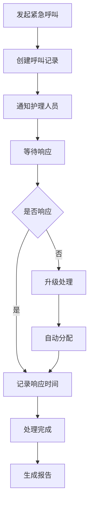

# Edge Functions技术文档

## 目录
1. [概述](#概述)
2. [架构设计](#架构设计)
3. [核心函数详解](#核心函数详解)
4. [函数分类](#函数分类)
5. [部署配置](#部署配置)
6. [性能优化](#性能优化)
7. [安全机制](#安全机制)
8. [监控日志](#监控日志)
9. [错误处理](#错误处理)
10. [开发指南](#开发指南)

---

## 概述

### Edge Functions架构
养老智能体系统采用Supabase Edge Functions作为边缘计算基础设施，实现以下功能：
- 健康数据实时处理和分析
- 紧急呼叫响应和处理
- AI模型推理和预测
- 数据同步和缓存管理
- 第三方服务集成

### 技术特点
- **边缘计算**: 就近处理，降低延迟
- **无服务器架构**: 自动扩缩容，运维简单
- **事件驱动**: 响应式数据处理
- **高可用**: 99.9%可用性保证

### 运行环境
- **运行时**: Deno
- **TypeScript支持**: 原生支持
- **内置API**: HTTP请求、文件操作、数据库访问
- **安全沙箱**: 代码隔离执行

---

## 架构设计

### 整体架构
```
┌─────────────────────────────────────────────────────────────┐
│                    Edge Functions                          │
├─────────────────────────────────────────────────────────────┤
│ 健康数据函数  │ 紧急呼叫函数  │ AI分析函数  │ 服务管理函数   │
├─────────────────────────────────────────────────────────────┤
│                    共享服务层                              │
├─────────────────────────────────────────────────────────────┤
│ 数据访问层    │ 认证授权层    │ 日志监控层  │ 配置管理层   │
├─────────────────────────────────────────────────────────────┤
│                    Supabase服务                            │
└─────────────────────────────────────────────────────────────┘
```

### 函数分类
```yaml
数据处理类:
  - health-data-upload: 健康数据上传
  - care-data-analytics: 护理数据分析
  - location-tracking: 位置跟踪

业务逻辑类:
  - appointment-booking: 预约挂号
  - companion-chat: 陪伴聊天
  - medication-reminder: 用药提醒

AI智能类:
  - emotion-analysis: 情感分析
  - content-recommend: 内容推荐
  - health-analysis: 健康分析

监控告警类:
  - fall-detection-alert: 跌倒检测告警
  - chronic-disease-monitor: 慢病监控
  - emergency-call-handler: 紧急呼叫处理
```

---

## 核心函数详解

### 1. health-data-upload (健康数据上传)

#### 功能描述
接收和处理来自智能设备的健康数据，包括血压、心率、血糖等指标，实时进行异常检测和预警。

#### 核心逻辑
```typescript
// 数据处理流程
1. 接收设备上传的健康数据
2. 数据验证和清洗
3. AI异常检测算法
4. 数据存储到数据库
5. 异常数据自动告警
6. 返回处理结果
```

#### API接口
```http
POST /functions/v1/health-data-upload
Content-Type: application/json
Authorization: Bearer <jwt_token>

{
  "user_id": 12345,
  "device_id": "device-uuid",
  "data_type": "blood_pressure",
  "systolic_pressure": 120.5,
  "diastolic_pressure": 80.0,
  "heart_rate": 75,
  "measurement_time": "2025-11-18T15:19:03.000Z"
}
```

#### 异常检测规则
```yaml
血压异常:
  高血压: 收缩压 >= 140 或 舒张压 >= 90
  低血压: 收缩压 < 90 或 舒张压 < 60

心率异常:
  心动过速: 心率 > 100
  心动过缓: 心率 < 60

血糖异常:
  高血糖: 血糖 > 7.0 mmol/L
  低血糖: 血糖 < 3.9 mmol/L
```

#### 响应格式
```json
{
  "data": {
    "health_data": {
      "record_id": 98765,
      "user_id": 12345,
      "abnormal_flag": 0,
      "ai_analysis": {
        "health_score": 85,
        "recommendations": ["继续保持良好的生活习惯"]
      }
    }
  }
}
```

### 2. emergency-call-handler (紧急呼叫处理)

#### 功能描述
处理用户发起的紧急呼叫，包括创建呼叫、分配护理人员、响应处理等全流程管理。

#### 业务流程


#### API接口
```http
POST /functions/v1/emergency-call-handler
Content-Type: application/json

{
  "action": "create",
  "user_id": 12345,
  "call_type": "health_emergency",
  "severity_level": 2,
  "location_latitude": 30.584354,
  "location_longitude": 114.304363
}
```

#### 呼叫类型定义
```yaml
health_emergency: 健康紧急情况
fall_accident: 跌倒事故
medical_consultation: 医疗咨询
device_malfunction: 设备故障
other_emergency: 其他紧急情况
```

#### 严重程度等级
```yaml
1: 低风险 - 一般咨询或建议
2: 中风险 - 需要关注和处理
3: 高风险 - 立即响应
4: 极危险 - 生命威胁，紧急救援
```

### 3. companion-chat (陪伴聊天)

#### 功能描述
提供AI智能陪伴聊天功能，支持自然语言交互、情感陪伴、内容推荐等。

#### 功能特性
- **自然语言理解**: 支持中文语音和文字输入
- **情感识别**: 分析用户情绪状态
- **个性化回复**: 基于用户画像的个性化回答
- **记忆功能**: 记住对话历史和用户偏好
- **安全过滤**: 内容安全检测和过滤

#### API接口
```http
POST /functions/v1/companion-chat
Content-Type: application/json

{
  "user_id": 12345,
  "message": "今天感觉有点不舒服",
  "message_type": "text",
  "emotion_context": "sad",
  "include_health_suggestion": true
}
```

#### 响应示例
```json
{
  "data": {
    "reply": "听起来您可能有点不舒服。建议您先测量一下血压和体温，如果情况严重的话，请及时联系医生。您也可以和家人分享一下您的感受。",
    "emotion_detected": "sad",
    "health_suggestions": [
      "建议测量血压",
      "多休息，注意保暖"
    ],
    "follow_up_actions": [
      "schedule_health_check",
      "notify_family"
    ]
  }
}
```

### 4. health-analysis (健康分析)

#### 功能描述
基于用户健康数据进行深度分析，包括趋势分析、风险评估、个性化建议等。

#### 分析维度
- **趋势分析**: 健康指标变化趋势
- **异常检测**: 基于AI算法的异常识别
- **风险评估**: 健康风险等级评估
- **个性化建议**: 基于用户情况的定制建议
- **预测分析**: 健康状况预测

#### API接口
```http
POST /functions/v1/health-analysis
Content-Type: application/json

{
  "user_id": 12345,
  "analysis_type": "comprehensive",
  "data_period": {
    "start_date": "2025-10-01",
    "end_date": "2025-11-18"
  },
  "include_predictions": true
}
```

#### 分析结果
```json
{
  "data": {
    "health_score": 78,
    "trend_analysis": {
      "blood_pressure": "slightly_elevated",
      "heart_rate": "stable",
      "weight": "gradual_increase"
    },
    "risk_assessment": {
      "hypertension_risk": "medium",
      "diabetes_risk": "low",
      "cardiovascular_risk": "medium"
    },
    "recommendations": [
      "控制钠盐摄入",
      "增加有氧运动",
      "定期监测血压"
    ],
    "predictions": {
      "next_month_bp": "120-130/75-85",
      "recommended_actions": ["diet_control", "exercise_plan"]
    }
  }
}
```

---

## 函数分类

### 1. 数据处理类函数

#### health-data-upload
- **功能**: 健康数据上传和预处理
- **输入**: 设备健康数据
- **输出**: 结构化数据、异常检测结果
- **性能**: 支持1000 QPS

#### location-tracking
- **功能**: 实时位置跟踪和轨迹分析
- **输入**: GPS坐标、时间戳
- **输出**: 位置信息、轨迹数据
- **特性**: 支持地理围栏

#### care-data-analytics
- **功能**: 护理数据分析和统计
- **输入**: 护理记录、服务数据
- **输出**: 分析报告、统计图表
- **应用**: 护理质量评估

### 2. 业务逻辑类函数

#### appointment-booking
- **功能**: 医疗服务预约管理
- **输入**: 用户预约信息
- **输出**: 预约确认、排班信息
- **集成**: 与医疗系统对接

#### medication-reminder
- **功能**: 用药提醒和药物管理
- **输入**: 药物清单、用药时间
- **输出**: 提醒通知、用药记录
- **特性**: 支持多药物管理

#### order-dispatch
- **功能**: 服务订单分配和调度
- **输入**: 服务需求、位置信息
- **输出**: 分配结果、路径规划
- **优化**: 智能调度算法

### 3. AI智能类函数

#### emotion-analysis
- **功能**: 情感状态分析和识别
- **输入**: 文本、语音、行为数据
- **输出**: 情感类型、置信度
- **模型**: 预训练情感分析模型

#### content-recommend
- **功能**: 个性化内容推荐
- **输入**: 用户画像、兴趣偏好
- **输出**: 推荐内容、相关性评分
- **算法**: 协同过滤 + 内容推荐

#### fall-detection-alert
- **功能**: 跌倒检测和自动告警
- **输入**: 传感器数据、加速度信息
- **输出**: 跌倒确认、告警通知
- **实时性**: < 2秒响应时间

### 4. 监控告警类函数

#### chronic-disease-monitor
- **功能**: 慢性病监控和管理
- **输入**: 长期健康数据
- **输出**: 病程分析、治疗建议
- **周期**: 定期自动执行

#### government-data-aggregator
- **功能**: 政府数据汇总和上报
- **输入**: 平台运营数据
- **输出**: 标准化数据报表
- **合规性**: 符合监管要求

#### regulatory-report-generator
- **功能**: 合规报告生成
- **输入**: 监管要求、数据源
- **输出**: 合规报告、审计日志
- **自动性**: 定时自动生成

---

## 部署配置

### 环境变量配置
```bash
# Supabase配置
SUPABASE_URL=https://your-project.supabase.co
SUPABASE_SERVICE_ROLE_KEY=your-service-role-key

# AI服务配置
OPENAI_API_KEY=your-openai-key
GOOGLE_MAPS_API_KEY=your-google-maps-key

# 第三方服务
ALIYUN_SMS_KEY=your-aliyun-sms-key
WECHAT_API_KEY=your-wechat-api-key

# 应用配置
APP_ENV=production
LOG_LEVEL=info
MAX_REQUEST_SIZE=10mb
```

### 函数部署配置
```typescript
// deno.json
{
  "compilerOptions": {
    "allowJs": true,
    "strict": true,
    "noImplicitAny": true,
    "esModuleInterop": true
  },
  "functions": {
    "timeout": 300,
    "memory": 256,
    "concurrency": 100
  }
}
```

### 数据库权限配置
```sql
-- 为Edge Functions创建专用角色
CREATE ROLE edge_functions_role;
GRANT USAGE ON SCHEMA public TO edge_functions_role;
GRANT SELECT, INSERT, UPDATE ON ALL TABLES IN SCHEMA public TO edge_functions_role;

-- 创建RLS策略
CREATE POLICY "Edge functions can access data" ON health_data
FOR ALL TO edge_functions_role
USING (true);
```

---

## 性能优化

### 并发处理
```typescript
// 并发处理健康数据
const processBatch = async (records: HealthRecord[]) => {
  const batchSize = 50;
  const batches = chunk(records, batchSize);
  
  const results = await Promise.all(
    batches.map(batch => processHealthDataBatch(batch))
  );
  
  return flatten(results);
};
```

### 缓存策略
```typescript
// Redis缓存用户配置
const getUserConfig = async (userId: string) => {
  const cacheKey = `user_config:${userId}`;
  let config = await redis.get(cacheKey);
  
  if (!config) {
    config = await database.getUserConfig(userId);
    await redis.setex(cacheKey, 3600, JSON.stringify(config));
  }
  
  return config;
};
```

### 数据库优化
```sql
-- 为Edge Functions查询优化索引
CREATE INDEX CONCURRENTLY idx_health_data_user_time 
ON health_data(user_id, measurement_time DESC);

CREATE INDEX CONCURRENTLY idx_emergency_calls_status_time 
ON emergency_calls(response_status, call_time DESC);

-- 分区表优化
CREATE TABLE health_data_2025_11 PARTITION OF health_data
FOR VALUES FROM ('2025-11-01') TO ('2025-12-01');
```

---

## 安全机制

### 身份验证
```typescript
// JWT Token验证
const verifyAuth = async (req: Request) => {
  const authHeader = req.headers.get('Authorization');
  if (!authHeader?.startsWith('Bearer ')) {
    throw new Error('未授权访问');
  }
  
  const token = authHeader.substring(7);
  const payload = await jwt.verify(token, Deno.env.get('JWT_SECRET'));
  
  return payload;
};
```

### 输入验证
```typescript
// 使用Zod进行数据验证
import { z } from 'zod';

const HealthDataSchema = z.object({
  user_id: z.number().positive(),
  data_type: z.enum(['blood_pressure', 'heart_rate', 'blood_sugar']),
  systolic_pressure: z.number().optional(),
  diastolic_pressure: z.number().optional(),
  measurement_time: z.string().datetime()
});

const validateHealthData = (data: unknown) => {
  return HealthDataSchema.parse(data);
};
```

### 权限控制
```typescript
// 基于角色的权限控制
const checkPermission = (user: User, action: string, resource: string) => {
  const permissions = getUserPermissions(user.role);
  return permissions.some(p => 
    p.action === action && p.resource === resource
  );
};
```

### 数据脱敏
```typescript
// 敏感数据脱敏
const maskSensitiveData = (data: any) => {
  return {
    ...data,
    phone: data.phone?.replace(/(\d{3})\d{4}(\d{4})/, '$1****$2'),
    id_card: data.id_card?.replace(/(\d{6})\d{8}(\d{4})/, '$1********$2'),
    address: data.address?.replace(/(.{2}).*(.{2})$/, '$1***$2')
  };
};
```

---

## 监控日志

### 结构化日志
```typescript
const logger = {
  info: (message: string, context?: any) => {
    console.log(JSON.stringify({
      level: 'info',
      message,
      timestamp: new Date().toISOString(),
      function: 'health-data-upload',
      context
    }));
  },
  
  error: (error: Error, context?: any) => {
    console.error(JSON.stringify({
      level: 'error',
      message: error.message,
      stack: error.stack,
      timestamp: new Date().toISOString(),
      function: 'health-data-upload',
      context
    }));
  }
};
```

### 性能监控
```typescript
// 函数执行时间监控
const measureExecutionTime = async (fn: Function, ...args: any[]) => {
  const start = Date.now();
  const result = await fn(...args);
  const duration = Date.now() - start;
  
  logger.info('Function execution completed', {
    function: fn.name,
    duration,
    args: args.length
  });
  
  return result;
};
```

### 健康检查
```typescript
// 函数健康检查
const healthCheck = async () => {
  try {
    // 检查数据库连接
    await database.query('SELECT 1');
    
    // 检查外部服务
    await fetch('https://api.openai.com/v1/models', {
      headers: { 'Authorization': `Bearer ${Deno.env.get('OPENAI_API_KEY')}` }
    });
    
    return { status: 'healthy', timestamp: new Date().toISOString() };
  } catch (error) {
    return { 
      status: 'unhealthy', 
      error: error.message,
      timestamp: new Date().toISOString() 
    };
  }
};
```

---

## 错误处理

### 统一错误处理
```typescript
class FunctionError extends Error {
  constructor(
    message: string,
    public code: string,
    public statusCode: number = 500,
    public details?: any
  ) {
    super(message);
    this.name = 'FunctionError';
  }
}

// 错误处理中间件
const handleError = (error: any) => {
  if (error instanceof FunctionError) {
    return new Response(JSON.stringify({
      error: {
        code: error.code,
        message: error.message,
        details: error.details
      }
    }), {
      status: error.statusCode,
      headers: { 'Content-Type': 'application/json' }
    });
  }
  
  // 未知错误
  logger.error('Unexpected error', { error: error.message, stack: error.stack });
  
  return new Response(JSON.stringify({
    error: {
      code: 'INTERNAL_ERROR',
      message: '内部服务器错误'
    }
  }), {
    status: 500,
    headers: { 'Content-Type': 'application/json' }
  });
};
```

### 重试机制
```typescript
// 指数退避重试
const retryWithBackoff = async <T>(
  fn: () => Promise<T>,
  maxRetries: number = 3,
  baseDelay: number = 1000
): Promise<T> => {
  for (let i = 0; i < maxRetries; i++) {
    try {
      return await fn();
    } catch (error) {
      if (i === maxRetries - 1) throw error;
      
      const delay = baseDelay * Math.pow(2, i);
      await new Promise(resolve => setTimeout(resolve, delay));
    }
  }
  
  throw new Error('Max retries exceeded');
};
```

---

## 开发指南

### 开发环境搭建
```bash
# 安装Deno
curl -fsSL https://deno.land/install.sh | sh

# 安装Supabase CLI
npm install -g supabase

# 启动本地开发环境
supabase start

# 部署Edge Functions
supabase functions deploy
```

### 本地测试
```typescript
// 测试Edge Function
import { serve } from "https://deno.land/std@0.168.0/http/server.ts";
import { createClient } from 'https://esm.sh/@supabase/supabase-js@2';

serve(async (req) => {
  const corsHeaders = {
    'Access-Control-Allow-Origin': '*',
    'Access-Control-Allow-Headers': 'authorization, x-client-info, apikey, content-type',
  };
  
  try {
    // 测试逻辑
    const result = await processRequest(req);
    
    return new Response(
      JSON.stringify({ data: result }),
      { 
        headers: { ...corsHeaders, 'Content-Type': 'application/json' },
        status: 200 
      }
    );
  } catch (error) {
    return new Response(
      JSON.stringify({ error: error.message }),
      { 
        headers: { ...corsHeaders, 'Content-Type': 'application/json' },
        status: 500 
      }
    );
  }
});
```

### 调试技巧
```typescript
// 启用详细日志
const DEBUG = Deno.env.get('DEBUG') === 'true';

const debugLog = (message: string, data?: any) => {
  if (DEBUG) {
    console.log(`[DEBUG] ${message}`, data);
  }
};

// 性能分析
const profiler = {
  marks: new Map<string, number>(),
  
  start(name: string) {
    this.marks.set(name, performance.now());
  },
  
  end(name: string) {
    const start = this.marks.get(name);
    if (start) {
      const duration = performance.now() - start;
      debugLog(`Performance: ${name}`, { duration });
      this.marks.delete(name);
      return duration;
    }
  }
};
```

### 最佳实践
```yaml
代码规范:
  - 使用TypeScript进行类型安全开发
  - 遵循RESTful API设计原则
  - 统一的错误处理和日志记录
  - 代码注释和文档完善

性能优化:
  - 避免阻塞操作，使用异步处理
  - 合理使用缓存机制
  - 优化数据库查询
  - 控制函数执行时间

安全考虑:
  - 验证所有输入数据
  - 使用环境变量管理敏感信息
  - 实施权限控制
  - 记录审计日志

测试策略:
  - 编写单元测试
  - 进行集成测试
  - 性能测试和压力测试
  - 安全测试和漏洞扫描
```

---

## 总结

Edge Functions作为养老智能体系统的核心组件，提供了：

1. **高效的数据处理**: 实时健康数据分析和异常检测
2. **智能的响应机制**: 紧急呼叫自动处理和分配
3. **个性化的服务**: AI驱动的陪伴聊天和内容推荐
4. **全面的监控**: 健康数据趋势分析和预警
5. **完善的生态**: 与第三方服务无缝集成

通过持续的优化和改进，Edge Functions为构建智能化、人性化的养老服务提供了强有力的技术支撑。
